# Лабораторная работа №4

## Дисциплина: «Проектирование автоматизированных систем»

### Тема: «Разработка динамических моделей классового уровня»

---

## Задание кафедры

На основе моделей, созданных на предыдущих этапах, реализовать этап 6. Поскольку на каждом этапе могут быть введены элементы, не имеющие соответствия с элементами моделей предыдущих этапов, то такие новые элементы необходимо выделить.

**Проект:** Run Application — мобильное приложение для трекинга пробежек с элементами геймификации (захват территорий на карте). Стек: Flutter (клиент), FastAPI (backend REST API), PostgreSQL + PostGIS (база данных).

---

## 6.1 Диаграмма кооперации, спецификация диаграммы кооперации

Диаграмма кооперации описывает, как именно объекты системы взаимодействуют при выполнении одного сценария. В отличие от диаграммы последовательности, она акцентирует внимание на структуре связей между объектами и направлениях обмена данными.

### 6.1.1. Кооперация «Авторизация пользователя»

**Сценарий:** Пользователь вводит email и пароль; система проверяет данные через БД и при успехе предоставляет доступ к экрану карты.

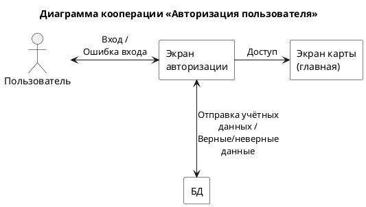

*Рисунок 1 – Диаграмма кооперации «Авторизация пользователя»*

| Параметр | Значение |
|----------|----------|
| Количество элементов | 4 |
| Количество связей | 3 |
| Топология | Иерархическая |

---

### 6.1.2. Кооперация «Трекинг пробежки»

**Сценарий:** Пользователь запускает пробежку на экране карты; система подписывается на GPS-поток, записывает координаты и обновляет трек на экране в реальном времени.

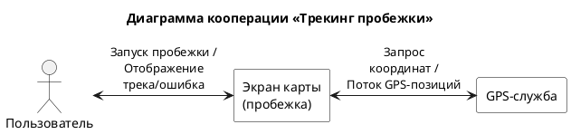

*Рисунок 2 – Диаграмма кооперации «Трекинг пробежки»*

| Параметр | Значение |
|----------|----------|
| Количество элементов | 3 |
| Количество связей | 2 |
| Топология | Линейная |

---

### 6.1.3. Кооперация «Завершение пробежки и захват территории»

**Сценарий:** Пользователь нажимает «Финиш»; данные маршрута отправляются в БД, где вычисляются полигоны захвата; итоги отображаются на экране результатов.

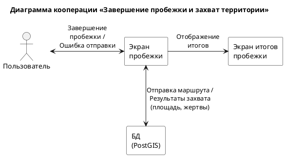

*Рисунок 3 – Диаграмма кооперации «Завершение пробежки и захват территории»*

| Параметр | Значение |
|----------|----------|
| Количество элементов | 4 |
| Количество связей | 3 |
| Топология | Иерархическая |

---

### 6.1.4. Кооперация «Просмотр территорий и уведомлений»

**Сценарий:** Пользователь просматривает карту; система загружает территории для видимой области и проверяет наличие уведомления о захвате территории другим игроком.

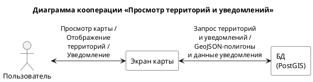

*Рисунок 4 – Диаграмма кооперации «Просмотр территорий и уведомлений»*

| Параметр | Значение |
|----------|----------|
| Количество элементов | 3 |
| Количество связей | 2 |
| Топология | Линейная |

---

## 6.2 Диаграмма последовательности сообщений, спецификация объектов и сообщений, исходный код

Диаграмма последовательности позволяет показать временную последовательность обмена сообщениями между объектами системы при выполнении конкретного варианта использования. Она иллюстрирует, какие вызовы происходят, в каком порядке и кто их инициирует.

### 6.2.1. Последовательность «Авторизация пользователя»

**Спецификация объектов:**

| Объект | Класс | Описание |
|--------|-------|----------|
| User | Актор | Пользователь приложения |
| LoginPage | StatefulWidget | Экран входа с полями email/пароль |
| AuthController | StateNotifier | Управляет состоянием авторизации |
| AuthApi | Класс | HTTP-клиент для эндпоинтов `/auth` |
| Dio | HttpClient | HTTP-клиент с interceptor'ами |
| AuthRouter | FastAPI Router | Обрабатывает `/auth/login`, `/auth/register`, `/auth/refresh` |
| PostgreSQL | СУБД | Таблицы `users`, `auth_identities`, `refresh_tokens` |
| TokenStorage | Класс | Secure Storage для access/refresh токенов |

**Спецификация сообщений:**

| № | Отправитель → Получатель | Сообщение | Тип |
|---|--------------------------|-----------|-----|
| 1 | User → LoginPage | Ввод email, пароля, нажатие «Войти» | Пользовательское действие |
| 2 | LoginPage → AuthController | login(email, password) | Вызов метода |
| 3 | AuthController → AuthApi | login(LoginRequest) | Async вызов |
| 4 | AuthApi → Dio | POST /auth/login | HTTP запрос |
| 5 | Dio → AuthRouter | HTTP POST {email, password} | Сетевой вызов |
| 6 | AuthRouter → PostgreSQL | SELECT … FROM auth_identities | SQL запрос |
| 7 | PostgreSQL → AuthRouter | user_id, password_hash | Результат |
| 8 | AuthRouter → AuthRouter | verify_password(password, hash) | Внутренний вызов |
| 9 | AuthRouter → PostgreSQL | INSERT INTO refresh_tokens | SQL запрос |
| 10 | AuthRouter → Dio | AuthResponse {access_token, refresh_token} | HTTP ответ |
| 11 | Dio → AuthApi | AuthResponse | Ответ |
| 12 | AuthApi → AuthController | AuthResponse | Возврат |
| 13 | AuthController → TokenStorage | saveTokens(access, refresh) | Вызов метода |
| 14 | AuthController → LoginPage | state = authenticated | Уведомление |

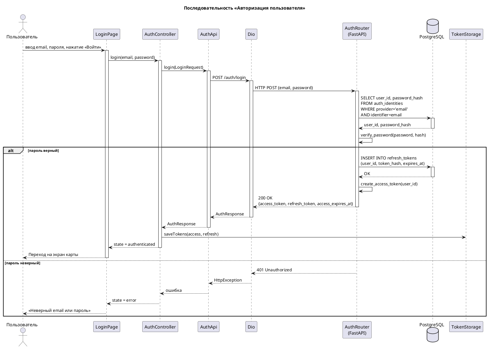

*Рисунок 5 – Диаграмма последовательности «Авторизация пользователя»*

**Фрагмент исходного кода backend (auth.py):**

```python
@router.post("/login", response_model=AuthResponse)
def login(payload: LoginRequest, request: Request) -> AuthResponse:
    email = payload.email.strip().lower()
    refresh = new_refresh_token()
    refresh_hash = refresh_token_hash(refresh)
    refresh_expires_at = int(time.time()) + settings.refresh_token_ttl_seconds

    with db_conn() as conn:
        with conn.cursor() as cur:
            cur.execute(
                "SELECT u.id, ai.password_hash, u.is_banned "
                "FROM auth_identities ai JOIN users u ON u.id = ai.user_id "
                "WHERE ai.provider = 'email' AND ai.identifier = %s",
                (email,),
            )
            row = cur.fetchone()
            if row is None:
                raise HTTPException(status_code=401, detail="invalid credentials")

            user_id, pw_hash, is_banned = row
            if not verify_password(payload.password, pw_hash):
                raise HTTPException(status_code=401, detail="invalid credentials")

            cur.execute(
                "INSERT INTO refresh_tokens (user_id, token_hash, expires_at, user_agent, ip) "
                "VALUES (%s, %s, to_timestamp(%s), %s, %s)",
                (user_id, refresh_hash, refresh_expires_at,
                 request.headers.get("user-agent"),
                 request.client.host if request.client else None),
            )

    access = create_access_token(user_id=str(user_id))
    return AuthResponse(
        access_token=access.token,
        access_expires_at=access.expires_at,
        refresh_token=refresh,
    )
```

---

### 6.2.2. Последовательность «Трекинг пробежки»

**Спецификация объектов:**

| Объект | Класс | Описание |
|--------|-------|----------|
| User | Актор | Пользователь |
| MapPage | StatefulWidget | Экран карты с кнопкой старта |
| RunTrackerController | StateNotifier | Управляет жизненным циклом пробежки |
| Geolocator | SDK | Поток GPS-координат |
| ConnectivityPlus | SDK | Мониторинг интернет-соединения |

**Спецификация сообщений:**

| № | Отправитель → Получатель | Сообщение | Тип |
|---|--------------------------|-----------|-----|
| 1 | User → MapPage | Нажатие «Начать пробежку» | Действие |
| 2 | MapPage → RunTrackerController | start() | Вызов метода |
| 3 | RunTrackerController → RunTrackerController | countdown(3 секунды) | Таймер |
| 4 | RunTrackerController → Geolocator | getPositionStream(accuracy: best, interval: 800ms) | Подписка |
| 5 | RunTrackerController → ConnectivityPlus | onConnectivityChanged | Подписка |
| 6 | Geolocator → RunTrackerController | Position(lat, lng, accuracy, speed, ts) | Событие (loop) |
| 7 | RunTrackerController → RunTrackerController | addPoint() / createPause(gps_lost) | Внутренний |
| 8 | RunTrackerController → MapPage | state update (distance, elapsed, track) | Уведомление |

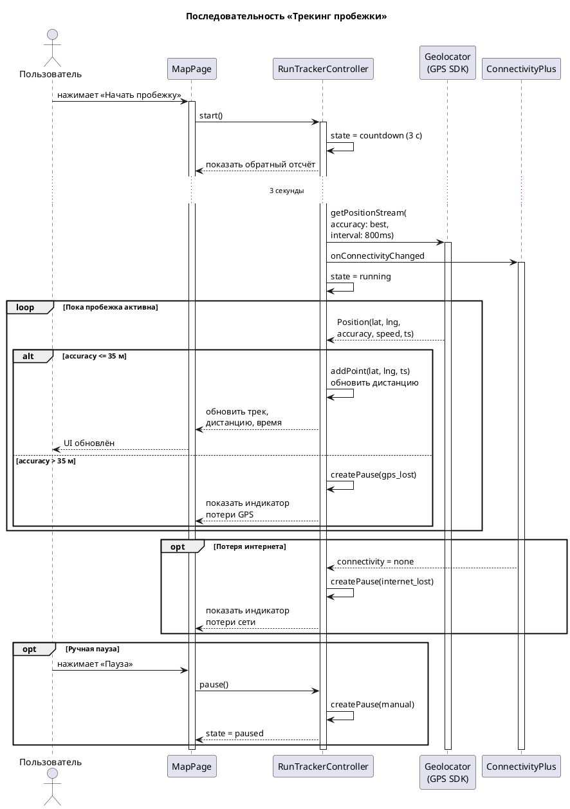

*Рисунок 6 – Диаграмма последовательности «Трекинг пробежки»*

**Фрагмент исходного кода Flutter (run_tracker_controller.dart) — логика старта и записи точек:**

```dart
Future<void> start() async {
  state = state.copyWith(phase: RunPhase.countdown);
  for (var i = 3; i > 0; i--) {
    state = state.copyWith(countdownValue: i);
    await Future.delayed(const Duration(seconds: 1));
  }
  state = state.copyWith(phase: RunPhase.running);
  _startGpsStream();
  _startConnectivityMonitor();
}

void _onPosition(Position pos) {
  if (pos.accuracy > 35) {
    _createPause(PauseReason.gpsLost);
    return;
  }
  _resumeIfAutoPaused(PauseReason.gpsLost);
  final point = TrackPoint(lat: pos.latitude, lng: pos.longitude, ...);
  _points.add(point);
  _updateDistance(point);
  state = state.copyWith(points: _points, distance: _totalDistance);
}
```

---

### 6.2.3. Последовательность «Завершение пробежки и захват территории»

**Спецификация объектов:**

| Объект | Класс | Описание |
|--------|-------|----------|
| User | Актор | Пользователь |
| RunOverlay | Widget | Оверлей с кнопками управления пробежкой |
| RunTrackerController | StateNotifier | Контроллер активности |
| RunsApi | Класс | HTTP-клиент для `/runs` |
| RunsRouter | FastAPI Router | Обработка `/runs/finish` |
| PostgreSQL+PostGIS | СУБД | Хранение данных, пространственные вычисления |
| RunSummaryPage | StatelessWidget | Экран итогов пробежки |

**Спецификация сообщений:**

| № | Отправитель → Получатель | Сообщение | Тип |
|---|--------------------------|-----------|-----|
| 1 | User → RunOverlay | Нажатие «Финиш» | Действие |
| 2 | RunOverlay → RunTrackerController | finish() | Вызов |
| 3 | RunTrackerController → RunTrackerController | closeOpenPauses(), buildRequest() | Внутренний |
| 4 | RunTrackerController → RunsApi | POST /runs/finish (RunFinishRequest) | Async |
| 5 | RunsApi → RunsRouter | HTTP POST | Сетевой |
| 6 | RunsRouter → RunsRouter | haversine_m(), wkt_linestring() | Внутренний |
| 7 | RunsRouter → PostgreSQL+PostGIS | INSERT INTO runs, run_points, run_pauses | SQL |
| 8 | RunsRouter → PostgreSQL+PostGIS | SELECT finalize_run_capture(run_id) | SQL (функция) |
| 9 | PostgreSQL+PostGIS → PostgreSQL+PostGIS | compute_capture_polygons(), ST_Union, ST_Difference | PostGIS |
| 10 | PostgreSQL+PostGIS → RunsRouter | capture_area_m2, victims_count | Результат |
| 11 | RunsRouter → RunsApi | RunFinishResponse | HTTP ответ |
| 12 | RunsApi → RunTrackerController | RunFinishResponse | Возврат |
| 13 | RunTrackerController → RunSummaryPage | Открытие экрана итогов | Навигация |

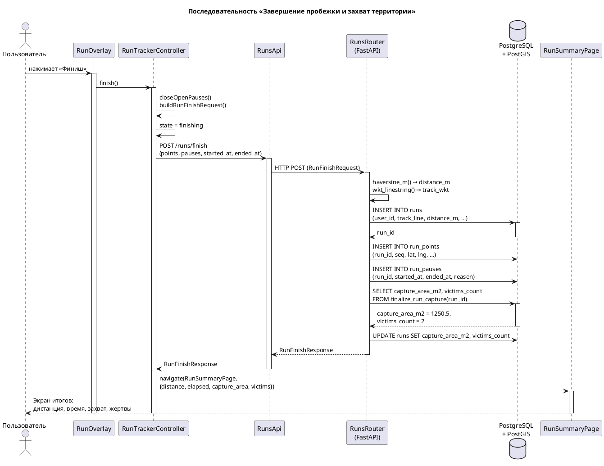

*Рисунок 7 – Диаграмма последовательности «Завершение пробежки и захват территории»*

**Фрагмент исходного кода backend (runs.py):**

```python
@router.post("/finish", response_model=RunFinishResponse)
def finish_run(payload: RunFinishRequest, user_id: str = Depends(current_user_id)):
    # ... расчёт дистанции и формирование track_wkt ...
    track_wkt = wkt_linestring(coords)
    with db_conn() as conn:
        with conn.cursor() as cur:
            cur.execute(
                "INSERT INTO runs (user_id, status, started_at, ended_at, "
                "distance_m, elapsed_s, paused_s, moving_s, points, track_line) "
                "VALUES (%s, 'finished', %s, %s, %s, %s, %s, %s, %s, "
                "ST_SetSRID(ST_GeomFromText(%s), 4326)) RETURNING id",
                (user_id, payload.started_at, payload.ended_at,
                 float(distance_m), elapsed_s, paused_s, moving_s,
                 points_jsonb, track_wkt),
            )
            run_id = cur.fetchone()[0]
            # ... insert run_points, run_pauses ...
            cur.execute(
                "SELECT capture_area_m2, victims_count "
                "FROM finalize_run_capture(%s)", (run_id,))
            cap_area, victims = cur.fetchone()
    return RunFinishResponse(run_id=str(run_id), distance_m=float(distance_m),
                             capture_area_m2=float(cap_area), victims_count=int(victims), ...)
```

---

### 6.2.4. Последовательность «Просмотр территорий и уведомлений»

**Спецификация объектов:**

| Объект | Класс | Описание |
|--------|-------|----------|
| User | Актор | Пользователь |
| MapPage | StatefulWidget | Экран карты |
| TerritoriesController | StateNotifier | Загрузка территорий по bbox |
| TerritoriesApi | Класс | HTTP-клиент для `/territories` |
| TerritoriesRouter | FastAPI Router | Обработка `/territories` |
| LastNotificationProvider | Provider | Провайдер последнего уведомления |
| NotificationsRouter | FastAPI Router | Обработка `/notifications/last` |
| PostgreSQL+PostGIS | СУБД | Территории и уведомления |

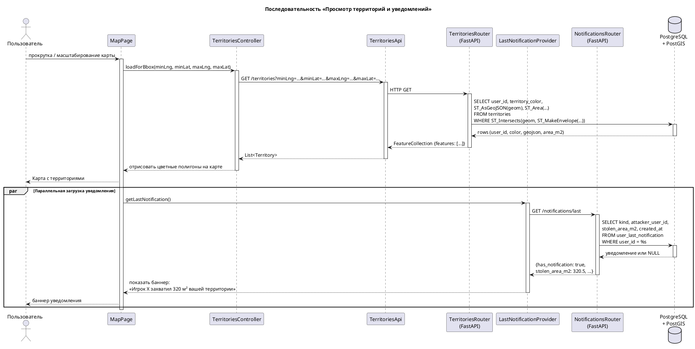

*Рисунок 8 – Диаграмма последовательности «Просмотр территорий и уведомлений»*

**Фрагмент исходного кода backend (territories.py):**

```python
@router.get("")
def get_territories(
    min_lng: float = Query(..., alias="minLng"),
    min_lat: float = Query(..., alias="minLat"),
    max_lng: float = Query(..., alias="maxLng"),
    max_lat: float = Query(..., alias="maxLat"),
) -> dict:
    with db_conn() as conn:
        with conn.cursor() as cur:
            cur.execute(
                "SELECT t.user_id::text, u.territory_color, "
                "ST_AsGeoJSON(t.geom)::text, "
                "ST_Area(ST_Transform(t.geom, 3857))::double precision "
                "FROM territories t JOIN users u ON u.id = t.user_id "
                "WHERE ST_Intersects(t.geom, ST_MakeEnvelope(%s,%s,%s,%s,4326))",
                (min_lng, min_lat, max_lng, max_lat),
            )
            features = [{"type": "Feature",
                         "geometry": json.loads(geojson),
                         "properties": {"user_id": uid, "territory_color": color,
                                        "area_m2": area}}
                        for uid, color, geojson, area in cur.fetchall()]
    return {"type": "FeatureCollection", "features": features}
```

---

## 6.3 Диаграмма состояний классов системы, спецификация состояний и переходов, исходный код

Диаграмма состояний описывает жизненный цикл одного конкретного класса, фиксируя, какие состояния он может принимать, события, запускающие переходы между состояниями, и действия, выполняемые при входе/выходе из них.

### 6.3.1. Состояния класса AuthController

**Описание:** `AuthController` (Flutter, StateNotifier) управляет состоянием аутентификации пользователя: от начального экрана входа до авторизованного состояния.

**Спецификация состояний:**

| Состояние | Описание | Действие при входе |
|-----------|----------|--------------------|
| Initial | Проверка наличия сохранённых токенов | Чтение TokenStorage |
| Unauthenticated | Токены отсутствуют или невалидны | Показать экран входа |
| Authenticating | Выполняется запрос login/register | Показать индикатор загрузки |
| Authenticated | Успешная авторизация, токены сохранены | Перейти на карту |
| AuthError | Ошибка авторизации | Показать сообщение об ошибке |
| Refreshing | Обновление access-токена через refresh | — (фоновый процесс) |

**Спецификация переходов:**

| Из | В | Событие / Условие | Действие |
|----|---|-------------------|----------|
| [*] | Initial | Запуск приложения | Проверить TokenStorage |
| Initial | Authenticated | Токены найдены и валидны | Инициализировать контекст |
| Initial | Unauthenticated | Токены не найдены | — |
| Unauthenticated | Authenticating | Пользователь нажал «Войти» / «Регистрация» | POST /auth/login или /auth/register |
| Authenticating | Authenticated | 200 OK (AuthResponse) | Сохранить токены |
| Authenticating | AuthError | 401/409/422 | Установить текст ошибки |
| AuthError | Unauthenticated | Пользователь закрыл ошибку | Сбросить ошибку |
| Authenticated | Refreshing | access_token истёк (401) | POST /auth/refresh |
| Refreshing | Authenticated | Новые токены получены | Обновить TokenStorage |
| Refreshing | Unauthenticated | Refresh провалился | Очистить TokenStorage |
| Authenticated | Unauthenticated | Пользователь нажал «Выйти» | Очистить TokenStorage |

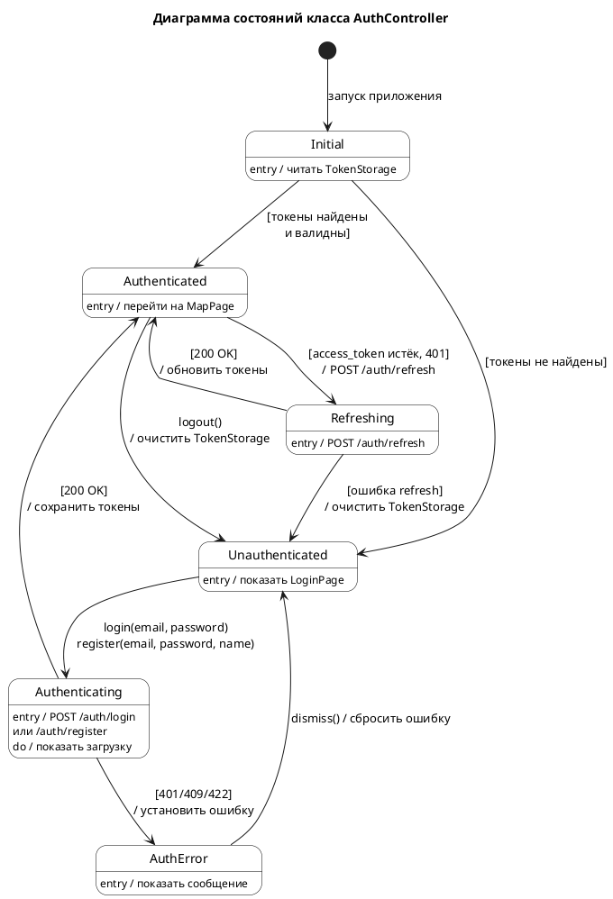

*Рисунок 9 – Диаграмма состояний класса AuthController*

---

### 6.3.2. Состояния класса RunTrackerController

**Описание:** `RunTrackerController` (Flutter, StateNotifier) управляет жизненным циклом пробежки: от ожидания старта через обратный отсчёт, активную запись трека, паузы до завершения и отправки результатов.

**Спецификация состояний:**

| Состояние | Описание | Действие при входе |
|-----------|----------|--------------------|
| Idle | Ожидание старта, пробежка не активна | Кнопка «Старт» доступна |
| Countdown | Обратный отсчёт 3 секунды | Таймер 3→2→1 |
| Running | Активная запись GPS-точек | Geolocator stream, таймер |
| Paused | Пауза (ручная / gps_lost / internet_lost) | Запись паузы |
| Finishing | Отправка результатов на сервер | POST /runs/finish |
| Finished | Результаты получены | Открыть RunSummaryPage |
| Error | Ошибка (GPS недоступен / ошибка сервера) | Показать сообщение |

**Спецификация переходов:**

| Из | В | Событие | Действие |
|----|---|---------|----------|
| [*] | Idle | Инициализация | — |
| Idle | Countdown | start() при доступном GPS | Запуск отсчёта 3 с |
| Idle | Error | start() при недоступном GPS | Показать ошибку |
| Countdown | Running | Отсчёт завершён | Подписка на GPS и сеть |
| Countdown | Idle | cancel() | Сброс отсчёта |
| Running | Paused | pause(manual) | Создать ручную паузу |
| Running | Paused | accuracy > 35 м | Создать паузу gps_lost |
| Running | Paused | connectivity = none | Создать паузу internet_lost |
| Paused | Running | resume() | Закрыть паузу |
| Paused | Running | accuracy ≤ 35 м | Закрыть auto-паузу |
| Paused | Running | connectivity восстановлена | Закрыть auto-паузу |
| Running | Finishing | finish() | Закрыть паузы, POST /runs/finish |
| Paused | Finishing | finish() | Закрыть паузы, POST /runs/finish |
| Finishing | Finished | 200 OK | Сохранить RunFinishResponse |
| Finishing | Error | Ошибка сервера | Показать ошибку |
| Error | Running | retry() | Восстановить активную фазу |
| Finished | Idle | done() | Сброс всех данных |

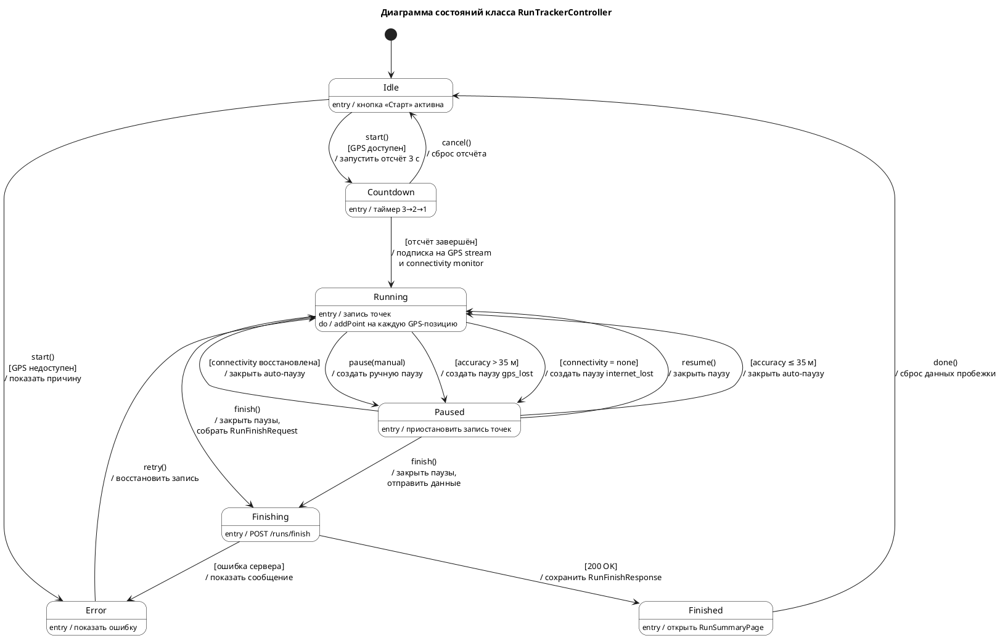

*Рисунок 10 – Диаграмма состояний класса RunTrackerController*

---

### 6.3.3. Состояния класса TerritoriesController

**Описание:** `TerritoriesController` (Flutter, StateNotifier) управляет загрузкой и отображением территорий на карте при изменении области просмотра (bounding box).

**Спецификация состояний:**

| Состояние | Описание | Действие при входе |
|-----------|----------|--------------------|
| Empty | Территории не загружены | — |
| Loading | Выполняется запрос GET /territories | Показать индикатор |
| Loaded | Территории получены и отрисованы | Отобразить полигоны |
| Error | Ошибка загрузки | Показать ошибку |

**Спецификация переходов:**

| Из | В | Событие | Действие |
|----|---|---------|----------|
| [*] | Empty | Инициализация | — |
| Empty | Loading | onMapMove(bbox) | GET /territories?minLng=…&… |
| Loading | Loaded | 200 OK (FeatureCollection) | Преобразовать в полигоны |
| Loading | Error | Ошибка сети / сервера | Установить ошибку |
| Loaded | Loading | onMapMove(newBbox) | Новый GET /territories |
| Error | Loading | retry() / onMapMove(bbox) | Повторить запрос |

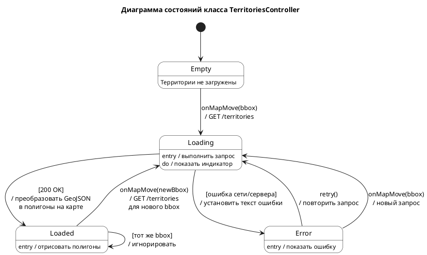

*Рисунок 11 – Диаграмма состояний класса TerritoriesController*

---

### 6.3.4. Состояния класса ProfileActionsController

**Описание:** `ProfileActionsController` (Flutter, StateNotifier) управляет состояниями профиля пользователя: загрузка данных, редактирование имени и аватара, изменение цвета территории, смена пароля.

**Спецификация состояний:**

| Состояние | Описание | Действие при входе |
|-----------|----------|--------------------|
| Initial | Профиль не загружен | — |
| Loading | Загрузка данных профиля | GET /me/profile |
| Loaded | Данные профиля получены | Отобразить профиль |
| Saving | Сохранение изменений | PATCH /me/profile или /me/territory-color |
| ChangingPassword | Выполняется смена пароля | PATCH /me/password |
| Error | Ошибка загрузки или сохранения | Показать ошибку |

**Спецификация переходов:**

| Из | В | Событие | Действие |
|----|---|---------|----------|
| [*] | Initial | Инициализация | — |
| Initial | Loading | Вкладка «Профиль» выбрана | GET /me/profile |
| Loading | Loaded | 200 OK | Показать профиль |
| Loading | Error | Ошибка | Показать ошибку |
| Loaded | Saving | saveProfile(displayName, avatarUrl) | PATCH /me/profile |
| Loaded | Saving | saveColor(color) | PATCH /me/territory-color |
| Loaded | ChangingPassword | changePassword(old, new) | PATCH /me/password |
| Saving | Loaded | 200 OK | Показать успех, обновить данные |
| Saving | Error | Ошибка | Показать ошибку |
| ChangingPassword | Loaded | 200 OK | Показать успех, очистить поля |
| ChangingPassword | Error | Ошибка | Показать ошибку |
| Error | Loading | retry() / pull-to-refresh | Повторить загрузку |
| Loaded | Loading | pull-to-refresh | Перезагрузить профиль |

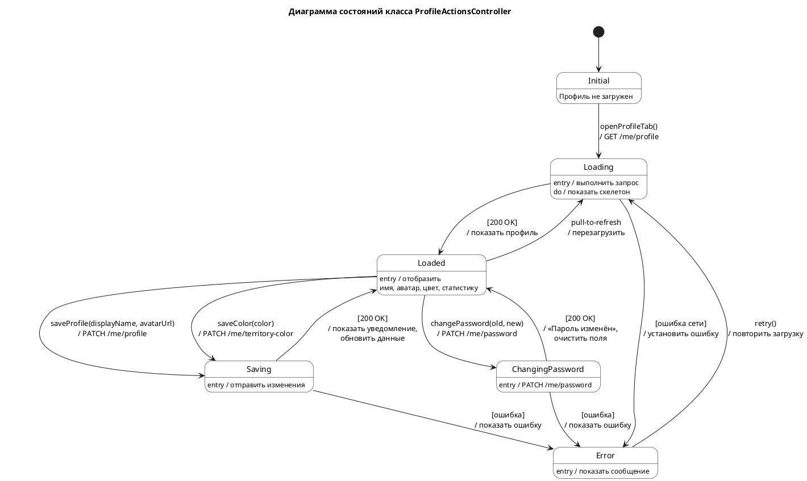

*Рисунок 12 – Диаграмма состояний класса ProfileActionsController*

---

## 6.4 Диаграмма активности (activity diagram)

Диаграмма активности описывает алгоритм или поток управления внутри метода или процесса.

### 6.4.1. Активность «Авторизация пользователя»

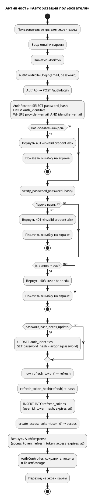

*Рисунок 13 – Диаграмма активности «Авторизация пользователя»*

---

### 6.4.2. Активность «Трекинг пробежки»

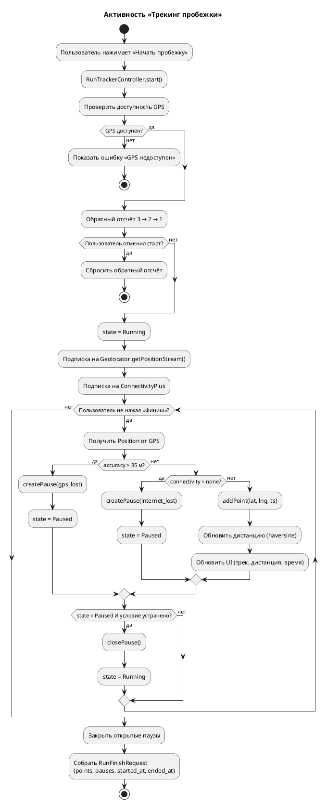

*Рисунок 14 – Диаграмма активности «Трекинг пробежки»*

---

### 6.4.3. Активность «Завершение пробежки и захват территории»

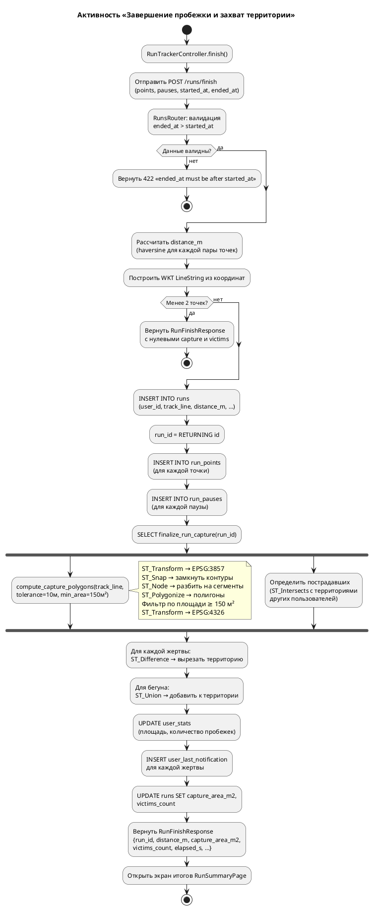

*Рисунок 15 – Диаграмма активности «Завершение пробежки и захват территории»*

---

### 6.4.4. Активность «Просмотр территорий и уведомлений»

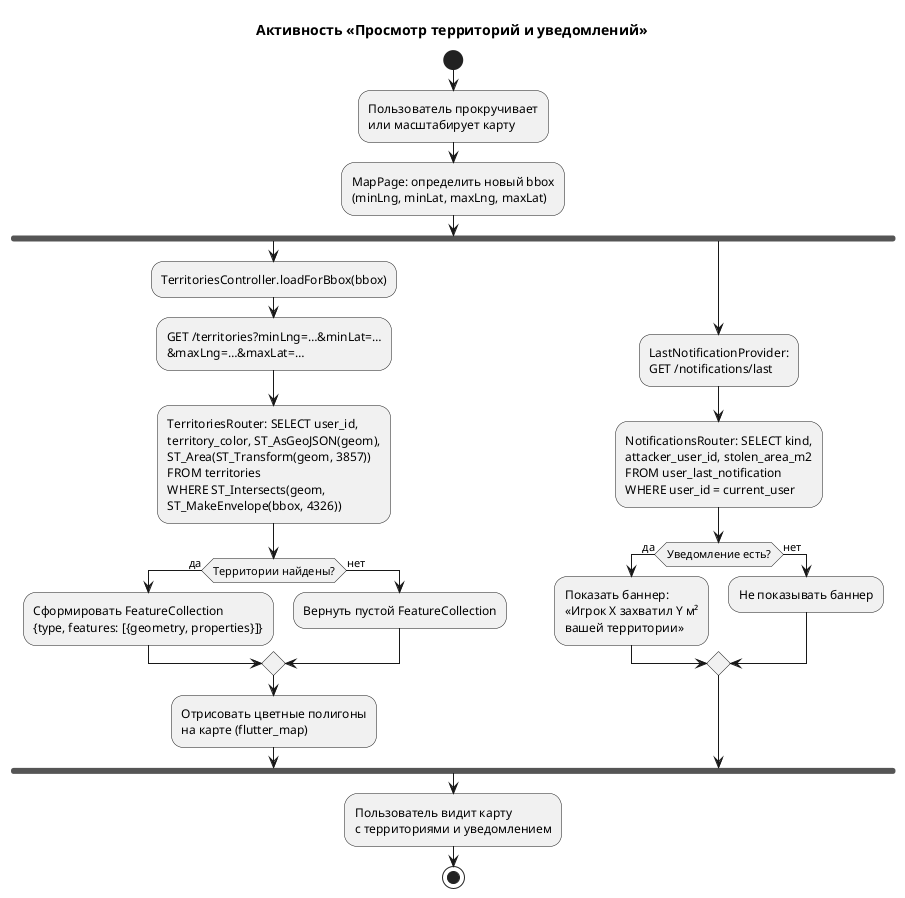

*Рисунок 16 – Диаграмма активности «Просмотр территорий и уведомлений»*

---

## Вопрос к лабораторной работе №4

**Иерархия** — вид структуры, отношения в которой характеризуются состоянием подчинённости и невозможностью существования / функционирования вышестоящих уровней без нижестоящих.

**Пример из проекта Run Application:**

В архитектуре приложения присутствует иерархия зависимостей между слоями:

```
MapPage (UI)
  └── RunTrackerController (логика)
        └── RunsApi (сетевой слой)
              └── Dio + TokenInterceptor (HTTP-клиент)
                    └── FastAPI Backend (сервер)
                          └── PostgreSQL + PostGIS (хранение данных)
```

Вышестоящий уровень (UI — `MapPage`) не может функционировать без нижестоящего (`RunTrackerController`), который в свою очередь зависит от `RunsApi`, и так далее до уровня базы данных. Без PostgreSQL backend не может обработать запрос; без backend клиент не может завершить пробежку; без контроллера UI не может управлять процессом трекинга.

Аналогия с организационной структурой: `MapPage` — начальник управления (даёт команду «начать пробежку»), `RunTrackerController` — начальник отдела (координирует GPS, паузы, отправку), `RunsApi` — сотрудник (выполняет конкретный HTTP-запрос). Ни один вышестоящий уровень не может выполнить свою функцию без нижестоящих.
