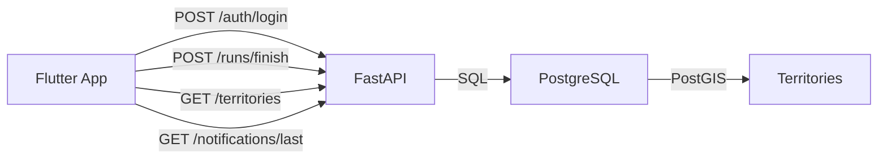

# Руководство по визуализации для презентации

## Инструменты для создания диаграмм

### 1. ER-диаграмма базы данных

**Вариант A: dbdiagram.io (онлайн, бесплатно)**
- Зайдите на https://dbdiagram.io
- Используйте формат DBML или создайте визуально
- Экспортируйте как PNG/SVG

**Вариант B: Draw.io (diagrams.net)**
- Онлайн: https://app.diagrams.net
- Создайте блоки для каждой таблицы
- Соедините стрелками (1:1, 1:N)
- Покажите ключевые поля

**Вариант C: pgAdmin / DBeaver**
- Скриншот структуры таблиц из инструмента БД
- Покажите связи (Foreign Keys)

**Что показать на слайде:**
- Основные таблицы: users, runs, territories, user_stats
- Связи между ними
- Выделить PostGIS типы (geometry)

---

### 2. Архитектура системы (общая схема)

**Простой вариант (Draw.io):**
```
┌─────────────────┐
│ Flutter Frontend │
│  (Mobile App)   │
└────────┬────────┘
         │ HTTP/REST
         │ JWT Auth
         ▼
┌─────────────────┐
│  FastAPI Backend │
│   (Python)      │
└────────┬────────┘
         │ SQL
         │ PostGIS
         ▼
┌─────────────────┐
│  PostgreSQL +    │
│    PostGIS      │
└─────────────────┘
```

**Что показать:**
- 3 основных блока
- Протоколы связи (HTTP, SQL)
- Направление данных

---

### 3. Схема API эндпоинтов

**Вариант: Mermaid диаграмма (можно вставить в Markdown)**


**Или просто список эндпоинтов с иконками:**
- 🔐 `/auth/*` - авторизация
- 🏃 `/runs/finish` - загрузка пробежки
- 🗺️ `/territories` - получение территорий
- 🔔 `/notifications/last` - уведомления

---

### 4. Процесс захвата территории

**Блок-схема (Draw.io):**
```
[GPS точки пробежки]
        ↓
[Создание LineString]
        ↓
[compute_capture_polygons()]
  ├─ Self-snapping
  ├─ Node (пересечения)
  ├─ Polygonize
  └─ Фильтр по площади
        ↓
[MultiPolygon захвата]
        ↓
[finalize_run_capture()]
  ├─ ST_Intersects (найти жертв)
  ├─ ST_Difference (убрать у жертв)
  ├─ ST_Union (добавить бегуну)
  └─ Обновить статистику
        ↓
[Результат: capture_area_m2, victims_count]
```

---

### 5. Скриншоты для Frontend

**Что нужно снять:**
1. **Карта с территориями**
   - Показать разные цвета для разных пользователей
   - Можно использовать тестовые данные

2. **Экран трекера пробежки**
   - Кнопки Start/Pause/Finish
   - Счетчик точек
   - Текущее время/дистанция

3. **Профиль пользователя**
   - Статистика: количество пробежек, общая дистанция
   - Площадь территории

4. **Уведомление**
   - "У вас отжали территорию X м²"

**Как сделать скриншоты:**
- iOS Simulator: Cmd+S
- Android Emulator: кнопка камеры в панели
- Обрежьте лишнее, оставьте только UI

---

### 6. Примеры кода для слайдов

**Не показывайте весь файл!** Только ключевые фрагменты:

**БД - пример функции:**
```sql
SELECT capture_area_m2, victims_count 
FROM finalize_run_capture(run_id, 10, 150);
```

**Backend - пример эндпоинта:**
```python
@router.post("/runs/finish")
def finish_run(payload: RunFinishRequest):
    # Вычисление расстояния
    # Сохранение в БД
    # Вызов finalize_run_capture()
    return RunFinishResponse(...)
```

**Frontend - пример виджета:**
```dart
FilledButton(
  onPressed: onStart,
  child: Text(l10n.runStart),
)
```

---

### 7. Swagger UI скриншот

**Как получить:**
1. Запустите бекенд: `uvicorn app.main:app --reload`
2. Откройте http://127.0.0.1:8000/docs
3. Сделайте скриншот главной страницы
4. Можно показать пример запроса (развернуть `/runs/finish`)

---

### 8. Структура проекта (опционально)

**Простое дерево:**
```
run_application/
├── db/              # SQL схемы и функции
├── python_backend/  # FastAPI
└── flutter_fronted/ # Flutter app
```

---

## Советы по оформлению

1. **Цветовая схема**: выберите 2-3 основных цвета, используйте их везде
2. **Шрифты**: используйте моноширинные для кода (Courier, Monaco)
3. **Размер текста**: минимум 18pt для читаемости
4. **Диаграммы**: не перегружайте деталями, только ключевые элементы
5. **Код**: максимум 10-15 строк на слайде
6. **Скриншоты**: обрезайте лишнее, оставляйте только важное

---

## Готовые материалы в проекте

- `docs/presentation_structure.md` - структура всех 5 слайдов
- `docs/database_er_diagram.txt` - текстовая ER-диаграмма
- `docs/api_architecture.txt` - описание API
- `db/schema.sql` - полная схема БД
- `db/functions.sql` - PostGIS функции
- `python_backend/app/main.py` - структура FastAPI
- `python_backend/README.md` - документация API

---

## Быстрый чеклист перед презентацией

- [ ] ER-диаграмма БД (визуализирована)
- [ ] Схема архитектуры (3 компонента)
- [ ] Список API эндпоинтов
- [ ] Блок-схема процесса захвата территории
- [ ] Скриншот Swagger UI
- [ ] Скриншоты Flutter приложения (3-4 экрана)
- [ ] Примеры кода (SQL, Python, Dart) - короткие фрагменты
- [ ] Все слайды в едином стиле


