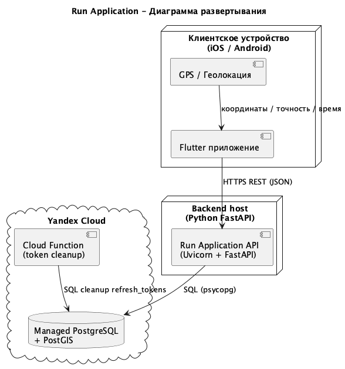
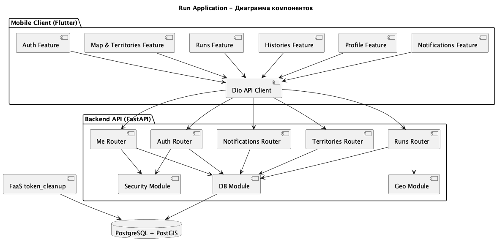

# 7 Реализация системы

## 7.1 Конфигурирование аппаратных и программных средств

### 7.1.1 Конфигурация аппаратных средств

Таблица 29 - Конфигурация аппаратных средств клиента и сервера

| Роль | Аппаратное средство | Конфигурация |
|---|---|---|
| Клиент (разработка/тестирование) | Ноутбук | Apple MacBook Air (Apple M4, 10 ядер CPU), 16 GB RAM, SSD 460 GiB |
| Клиент (эксплуатация) | Мобильное устройство | Смартфон с GPS-модулем (Android/iOS), стабильный доступ в интернет |
| Сервер приложений (Backend API) | Виртуальная машина / контейнерный хост | FastAPI + Uvicorn (Linux, 2+ vCPU, 4+ GB RAM) |
| Сервер данных | Облачная СУБД | Yandex Managed PostgreSQL + PostGIS |
| Фоновый сервис | Облачная среда | Yandex Cloud Functions (serverless, очистка refresh-токенов по расписанию) |

Для локальной разработки минимально рекомендуется: CPU 2+ ядра, RAM 4+ GB, SSD 20+ GB.

### 7.1.2 Конфигурация программных средств

Выбор программных средств выполнен с учетом совместимости клиента, серверной части и базы данных.

Таблица 30 - Конфигурация программных средств клиента

| Программное средство | Название | Версия |
|---|---|---|
| ОС клиента (разработка) | macOS | 26.3.1 |
| SDK мобильного клиента | Flutter | 3.38.4 |
| Язык клиента | Dart | 3.10.3 |
| Библиотека состояния | flutter_riverpod | 2.6.1 |
| HTTP-клиент | dio | 5.7.0 |
| Карта | flutter_map | 7.0.2 |
| Геолокация | geolocator | 13.0.2 |

Таблица 31 - Конфигурация программных средств сервера

| Программное средство | Название | Версия |
|---|---|---|
| Язык серверной части | Python | 3.11-3.13 (рекомендуется проектом) |
| Web-фреймворк | FastAPI | 0.115.6 |
| ASGI-сервер | Uvicorn | 0.32.1 |
| СУБД | PostgreSQL | 17.x |
| Георасширение СУБД | PostGIS | 3.x |
| Драйвер БД | psycopg | 3.2.13 |
| Аутентификация | PyJWT + passlib[argon2] | 2.10.1 + 1.7.4 |
| Облачная функция очистки токенов | Python runtime (Yandex Cloud Functions) | 3.12 |

## 7.2 Разработка моделей реализации

Рисунок __ — Диаграмма развертывания

Рисунок __ — Диаграмма компонентов

Для описания реализации системы используются структурные и динамические UML/SADT-модели, размещенные в репозитории:

- модели реализации: `docs/scheme/deployment_diagram.puml`, `docs/scheme/component_diagram.puml`;
- статические модели: `docs/scheme/system_class_diagram.puml`, `docs/scheme/compact_system_class_diagram.puml`;
- диаграммы взаимодействий: `docs/scheme/system_sequence_diagram.puml`, `docs/scheme/sequence_register_new_user.puml`, `docs/scheme/sequence_view_map_territories.puml`;
- диаграммы интерфейса и состояний: `docs/scheme/menu_structure_diagram.puml`, `docs/scheme/dialog_states_diagram.puml`;
- SADT-модели процессов: `docs/lab/practical_work_4_sadt.md`.

Диаграмма развертывания отражает размещение компонентов (мобильный клиент Flutter, API FastAPI, PostgreSQL/PostGIS, Cloud Function token cleanup) и сетевые взаимодействия между ними.

Диаграмма компонентов отражает разбиение на модули:

- мобильный клиент (auth, map/territories, runs, profile, histories, notifications);
- backend API (routers, security, db, geo, models);
- слой данных (таблицы и SQL-функции `db/schema.sql`, `db/functions.sql`);
- serverless-модуль обслуживания токенов (`faas/token_cleanup/handler.py`).

## 7.3 Генерация программного кода

Программный код системы сформирован в репозитории проекта:

- [https://github.com/Nikitin48/run_application](https://github.com/Nikitin48/run_application)

# 8 Тестирование и оценка системы

## 8.1 Выявление, обработка и устранение ошибок

Выполнено функциональное тестирование основных пользовательских сценариев:

- регистрация и вход пользователя;
- обновление access-токена через refresh-token;
- старт/финиш пробежки и отправка трека;
- захват и отображение территорий на карте;
- просмотр истории пробежек;
- работа с профилем и цветом территории;
- получение последнего уведомления о захвате территории.

Критических ошибок, приводящих к отказу системы в базовых сценариях, не выявлено. Обработка ошибок реализована через HTTP-коды и сообщения API (401/403/404/422/500) с действиями оператора, описанными в разделе 9.1.5.

## 8.2 Оценка проекта, системы и результатов ее работы

Таблица 32 - Параметры проекта и системы

| Параметр | Значение |
|---|---|
| Количество API-эндпоинтов | 12 |
| Количество таблиц БД | 9 |
| Количество SQL-функций геообработки | 2+ (в `db/functions.sql`) |
| Количество файлов клиентской части (Dart) | 58 |
| Количество файлов серверной части (Python, app) | 13 |
| Количество классов клиентской части | 66 |
| Количество классов серверной части | 18 |
| Общее количество классов | 84 |
| Количество диаграмм (PlantUML-файлы) | 11 |
| Количество опций меню (по UI-модели) | 13 |
| Количество основных экранов клиента | 5 (Login, Map, Histories, Profile, Run Summary) |
| Размер проекта на диске (репозиторий) | 2.2 GB |

# 9 Документирование системы

## 9.1 Руководство оператора

### 9.1.1 Назначение системы

Система предназначена для трекинга пробежек с элементами геймификации (захват территорий на карте).

Входные данные:

- учетные данные пользователя (email, пароль);
- GPS-координаты пробежки (точки трека, паузы, время старта/финиша);
- данные профиля пользователя (display name, avatar URL, цвет территории).

Выходные данные:

- список территорий в формате GeoJSON;
- история пробежек и агрегированная статистика;
- уведомление о последнем факте захвата территории другим пользователем;
- служебные ответы API (коды и текст ошибок/успеха).

### 9.1.2 Условия выполнения программы

Аппаратная конфигурация для выполнения программы приведена в разделе 7.1.1.
Программная конфигурация приведена в разделе 7.1.2.

Дополнительные условия выполнения:

- наличие подключения к сети интернет;
- наличие разрешения на геолокацию в мобильном приложении;
- доступность серверного API и PostgreSQL/PostGIS;
- для физического устройства - корректно заданный `API_BASE_URL`.

### 9.1.3 Выполнение программы

Порядок запуска в среде разработки:

1. Подготовить БД PostgreSQL/PostGIS и применить `db/schema.sql`, затем `db/functions.sql`.
2. Запустить backend:
   - `cd python_backend`
   - `python3 -m venv .venv && source .venv/bin/activate`
   - `pip install -r requirements.txt`
   - `./run.sh` (или `./run.sh release` для облачной БД)
3. Проверить backend: `GET /health`.
4. Запустить Flutter-клиент:
   - `cd flutter_fronted`
   - `flutter pub get`
   - `flutter run` (при необходимости с `--dart-define=API_BASE_URL=...`).

### 9.1.4 Сообщения оператору

Оператор получает сообщения:

- системные ответы API (`ok`, `has_notification`, JSON-данные профиля/истории/территорий);
- сообщения об ошибках авторизации и доступа (`missing token`, `invalid token`, `invalid credentials`);
- сообщения валидации входных данных (`422 Unprocessable Entity`);
- сообщения ресурса не найдено (`404`);
- сообщения о недоступности внешних сервисов (`500` и сетевые ошибки клиента).

### 9.1.5 Аварийные ситуации

При возникновении аварийных ситуаций рекомендуется:

- `401/403`: выполнить повторный вход, проверить валидность токена и права доступа;
- `404`: проверить корректность URL/параметров запроса и наличие данных в БД;
- `422`: проверить формат входных данных (время, координаты, email, пароль);
- `500`: проверить доступность PostgreSQL/PostGIS, переменные окружения, логи backend/FaaS;
- отсутствие геоданных: проверить разрешения геолокации, состояние GPS и интернет-соединение;
- отказ Cloud Function: проверить конфигурацию переменных окружения и расписание триггера.

В случае неустранимой ошибки оператору необходимо обратиться к администратору системы с приложением времени инцидента и фрагмента сообщения об ошибке.
